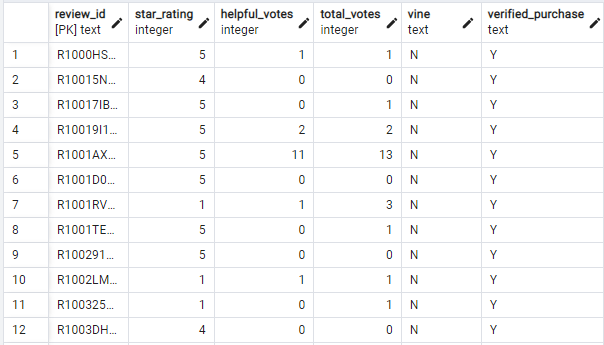

# Amazon_Vine_Analysis

## Overview
The purpose of this analysis is to dissect whether there is a bias in Vine (paid) and non-Vine (unpaid) reviews - are people more likely to be satisfied with a product when they receive it for free?

## Results
The initial table for a count of all the reviews, and more importantly their Vine status, was initially over 900,000 rows.

After filtering for reviews that were had at least 20 votes and were voted at least 50% helpful, I was able to perform a comparison of Vine and non-Vine reviews.

### Vine reviews
* Total number of reviews: 60
* Number of 5-star reviews: 34
* Percentage of 5-star reviews: 56%

### non-Vine reviews
* Total number of reviews: 14477
* Number of 5-star reviews: 8212
* Percentage of 5-star reviews: 56%

## Summary
In this set of reviews, miraculously, the Vine and non-Vine reviewers had the same dispositions. While it was shocking to see just how few reviewers were paid, it was even more shocking that they all ended up having the same percentage of 5-star reviews. This, to me, is inconclusive - non-Vine reviews so handily outnumber the Vine reviews that any conclusion drawn by this would feel thoughtless. I think a better way to make use of this data would be to find the overall skew - to include the 4, 3, 2, and 1 star reviews too. There would be something to be said if, for example, there were no ratings below 2 stars for Vine reviews while the non-Vine reviews had 20% negative reviews. I am biased towards Vine reviews being more positive than non-Vine reviews, but this dataset requires at least a further dive into the spread of the ratings for me to be able to form an actual view of any possible biases in Vine reviews.
